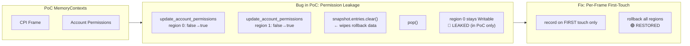
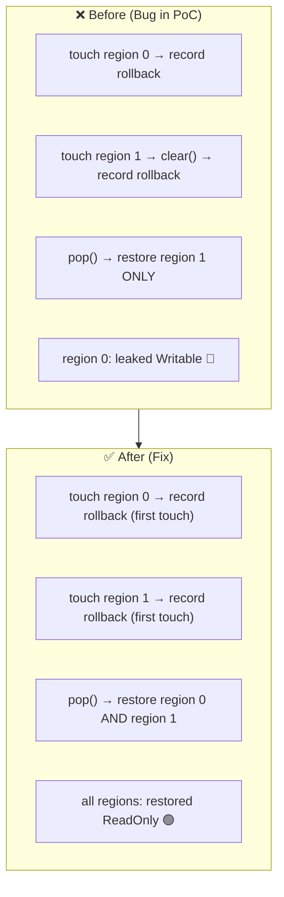
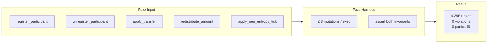

# agave-abiv2-memory-contexts

[](https://github.com/RFT-SIRM/UltraCore-RFT)
[](#-fuzzing-results)
[](https://github.com/anza-xyz/svm/issues/25)
[](LICENSE)

**SVM Memory Isolation Research · CPI Permission Model · Fuzzing Methodology**

_Part of the [UltraCore RFT](https://github.com/RFT-SIRM/UltraCore-RFT) execution platform_

* * *

## ⚠️ Important Update (August 2026)

This repository contains a **proof-of-concept implementation** of ABIv2 MemoryContexts, created for research and fuzzing methodology development.

**The `snapshot.entries.clear()` bug described below was present only in this PoC** and does **not** exist in the official `anza-xyz/agave-runtime/feat/abiv2`. The upstream team (notably @LucasSte) redesigned the architecture to use `abi_v2_prepare_for_instruction()` with explicit `make_immutable()`, which correctly resets permissions at every instruction boundary. A regression test for CPI writable-permission leakage passes in the official repository.

This repository is preserved as a **reference for the fuzzing methodology** demonstrated here (stateful invariant checking, 4.3B+ iterations) and for the CoreState accounting module. The permission-rollback PoC itself is superseded by the official implementation.

* * *

## 🎯 Overview

This repository was created to investigate the correctness boundary of per-CPI-frame writable permission rollback in a **custom ABIv2 MemoryContexts prototype**. It documents a bug found in that prototype, provides a fix, and validates the solution through extended deterministic fuzzing.

The architectural approach here (snapshot-based rollback) differs from the official `agave-runtime/feat/abiv2` design (per-instruction reconfiguration via `abi_v2_prepare_for_instruction`). This PoC should be read as a research artifact, not as a patch proposal for upstream.



* * *

## 🔬 Motivation

During research into CPI execution semantics, this PoC explored whether a snapshot-based rollback mechanism could correctly isolate writable permission changes across nested CPI frames. The investigation revealed a bug in the prototype's implementation and validated a fix through fuzzing.

**Note:** The official `agave-runtime/feat/abiv2` uses a different, non-snapshot-based mechanism that does not exhibit this bug.

* * *

## 🐛 Bug Found in PoC: Permission Leakage on Multiple Updates Within One Frame

### The Problem (PoC-only)

The prototype implementation cleared the current frame's rollback list on **every** call to `update_account_permissions`:

```rust
let snapshot = self.snapshots.last_mut().unwrap();
snapshot.entries.clear(); // ← wipes earlier rollback data in the same frame
```

If a single CPI frame issues more than one permission update before returning, the second call **erases** the rollback record written by the first. On `pop()`, only the last-touched account is restored; every earlier account retains its modified permission permanently.

### Reproducing Scenario

```rust
contexts.push_placeholder();                          // open CPI frame
contexts.update_account_permissions(&[(0, true)]);    // region 0: false → true
contexts.update_account_permissions(&[(1, true)]);    // region 1: false → true
                                                      // BUG: region 0 rollback is gone
contexts.pop();
// expected: region 0 = ReadOnly, region 1 = ReadOnly
// actual:   region 0 = Writable  ← leaked (in PoC only)
```

### The Fix

Record each account's pre-frame value **only on its first touch** within the frame, never overwriting it on subsequent calls.



See `src/memory_contexts.rs` and the regression test `multiple_permission_updates_in_one_frame_all_roll_back`.

* * *

## ⚖️ CoreState: Supply/Burn Invariant Module

`src/core_state.rs` (used by the fuzz harness only, not exported from `lib.rs`) is an independent accounting component enforcing:

```
TOTAL_SUPPLY == TOTAL_MINTED - TOTAL_BURNED
TOTAL_SUPPLY == TOTAL_BASE_SUM + (GLOBAL_FIELD × P)
```

### Two Bugs Found and Fixed via Fuzzing

| # | Bug | Impact | Fix |
|---|-----|--------|-----|
| 1 | `unregister_participant` and `apply_transfer` adjusted `total_base_sum` by an arbitrary delta after already rebalancing it, without reflecting that delta back into `total_supply` / `total_minted` | Breaks invariant 2 | Compute mint/burn deltas atomically; derive `total_supply` and `total_base_sum` from the validated result in a single step |
| 2 | Burn accounting used `saturating_sub`, silently masking the case where `burned > minted` instead of rejecting it | Corrupts invariant 1 | Replace with `checked_sub` + explicit error on underflow |

* * *

## ✅ Fuzzing Results

Extended CI fuzz run (`cargo fuzz run fuzz_target_1`, libFuzzer + `arbitrary`):



| Metric | Value |
|--------|-------|
| **Duration** | 5 h 55 m (21 300 s) |
| **Total executions** | 4 294 967 296+ |
| **Execution speed** | ~421 000 exec/s (GitHub Actions vCPU) |
| **RSS (stable)** | ~505 MB |
| **Invariant violations** | **0** |
| **Panics** | **0** |

Coverage stabilised at `cov: 53 ft: 166` by the first billion iterations, indicating the harness exhausted the reachable state space for this input size range before the run ended.

> **Note:** These numbers describe the fuzz harness on an isolated in-memory struct. They are **not** SVM transaction throughput figures and should not be compared to validator TPS benchmarks.

* * *

## 📁 Repository Layout

```
src/
  lib.rs                    — public API: memory_contexts, scheduler, shared_memory_protocol
  memory_contexts.rs        — per-frame writable permission tracking (PoC, bug + fix documented above)
  scheduler.rs              — conflict-aware transaction scheduling research
  shared_memory_protocol.rs — TPU/worker shared-memory message layouts
  core_state.rs             — standalone supply/mint/burn accounting (fuzz-only)
tests/
  integration_tests.rs      — integration and regression tests
fuzz/
  fuzz_targets/fuzz_target_1.rs — stateful invariant fuzzer
.github/workflows/          — CI: fast checks on push, 5h 55m fuzz on schedule
```

* * *

## 🚀 Running Tests and Fuzzing

```bash
# Unit + integration tests
cargo test

# 5-minute local fuzz run
cargo +nightly fuzz run fuzz_target_1 -- -max_total_time=300

# Full scheduled run (matches CI)
cargo +nightly fuzz run fuzz_target_1 -- -max_total_time=21300
```

* * *

## 🔮 Status and Next Steps

This is a **research repository**, not a production patch. The immediate goals are:

1. **Archive the permission-rollback PoC** — the official `agave-runtime/feat/abiv2` has superseded this approach with `abi_v2_prepare_for_instruction()` + `make_immutable()`.
2. **Preserve the fuzzing methodology** — the 4.3B-execution invariant harness and CoreState module remain valuable for future research on other Solana runtime components.
3. **Continue research** — focusing on upstream `agave-runtime` components (instruction account deduplication, VM error paths, scheduler internals) with tests against the actual codebase.

Architectural context and theoretical foundations: [UltraCore RFT](https://github.com/RFT-SIRM/UltraCore-RFT)

Upstream reference: [anza-xyz/svm#25](https://github.com/anza-xyz/svm/issues/25) (closed — bug was PoC-only)

* * *

## 🔗 Ecosystem Context

| Repository | Role | Relation |
|------------|------|----------|
| [UltraCore-RFT](https://github.com/RFT-SIRM/UltraCore-RFT) | Central laboratory & documentation | Parent organization |
| [Rift-L1-Blockchain](https://github.com/RFT-SIRM/Rift-L1-Blockchain) | Standalone Rust validator core | Same invariants, different runtime |
| [Rift-Network](https://github.com/RFT-SIRM/Rift-Network) | Solana on-chain protocol | Same invariants, Solana runtime |
| [agave-rift-scheduler](https://github.com/RFT-SIRM/agave-rift-scheduler) | Conflict-aware scheduling | Complementary runtime research |

* * *

## 📋 License

[](LICENSE)

 **[Apache License 2.0](LICENSE)** 

* * *

**Built in Rust · Verified by Mathematics · Zero Compromises**

_Part of the UltraCore RFT Execution Platform · © 2026 Eugeny (RFT-SIRM)_
